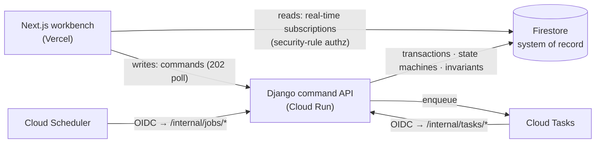

# BenefitServicing Workbench

An operations platform for servicing **employer-sponsored student-loan repayment benefits**: benefit activation, employer-funded contribution schedules, simulated payment processing with real transactional/idempotency/recovery controls, employment-change cascades, exception handling, and an immutable audit timeline. Firestore is the primary system of record; a Django command backend owns every write; a Next.js workbench subscribes read-only in real time.

**Status: Phases 1–6 merged — and deployed live** (a password-gated demo on Cloud Run + Vercel + real Firestore/Auth, project `bsw-demo`; see the [devops deployment report](specs/engineering-reports/deployment-devops.md)). The only remaining work is the deferred `propagate-denormalized` fan-out (`U13`, awaiting its producer command). Phases 1 (the framework-free `backend/common/` core, 60 unit tests + the scaffold), 2 (the full **domain command layer** — activation, the two-phase payment, suspend/resume/terminate, employment cascade, exceptions, notes, admin), and 3 (the **async layer** — OIDC-gated Cloud Tasks/Scheduler handlers behind a 202-cloud/200-inline completion protocol, a reconciliation sweeper + lease reaper, and recompute-from-source read-model projections) are built, QA'd, and merged to `main` (PRs #1–#3, #5, each CI-green + CodeRabbit-reviewed; a read-only security review + its hardening also merged, PR #4). **Phase 4 (the Workbench UI)** brings the operator app up over that backend: the *ledger + control room* design system + the **dashboard** + **loan portfolio** (**part 1**, PR #6 — merged), and the loan/benefit **detail screen** + the payment/exception **worklists** + a minimal emulator **auth surface** + the Playwright critical-path **e2e** (**part 2**, PR #7 — merged). **Phase 5** — an adversarial security review of the async + UI layers (no CRITICAL/HIGH/MEDIUM; all Phase-3 prerequisites verified) plus its hardening — is merged (PR #8). **Phase 6 — deployment** (PR #11 — merged) shipped the deploy IaC ([`infrastructure/`](infrastructure/) — Cloud Run + the Cloud Tasks queues + Cloud Scheduler crons + the `/readiness` flip + a `teardown` cost switch), the `make demo` local bring-up, and [`docs/demo-script.md`](docs/demo-script.md); the live Cloud Run + Vercel apply has since been **run for real** via that operator-run runbook (see the [devops deployment report](specs/engineering-reports/deployment-devops.md)), per [specs/19](specs/19-delivery-and-scope.md). Per-phase [engineering reports](specs/engineering-reports/) track what shipped.

## For reviewers — the high-signal path

Short on time? In order of signal:

1. **The thesis it's built around** — [specs/01 §1.6](specs/01-product-overview.md) + [specs/02](specs/02-architecture.md): *responsible use of Firestore for a financial workflow without pretending it removes the need for explicit transactional, idempotency, recovery, and async controls.* Everything else follows from that one question.
2. **The load-bearing correctness** — idempotency-in-transaction, the crash-safe two-phase payment, and the reconciliation re-drive. Read [specs/08](specs/08-idempotency-and-consistency.md) → [09](specs/09-payment-processing.md), then the code: [`backend/common/`](backend/common) (the framework-free money + state-machine core, 60 unit tests), [`backend/payments/`](backend/payments), [`backend/idempotency/`](backend/idempotency).
3. **How it was actually built** — the [engineering reports](specs/engineering-reports/) record each phase's *adversarial* QA, two independent security reviews, and the live-deploy record — including real bugs the process caught that compiled clean (a payment-cancellation race, a double-charge fencing gap, a post-commit crash-recovery gap).
4. **Try it live** — a password-gated demo (URL + access shared with the application). Land on the **dashboard**; on **Loans**, pick an employer to populate the portfolio (it's filter-first by design, not empty).

Then the full [22-doc spec set](specs/README.md) and the CI-green, CodeRabbit-reviewed code.

## Run the full demo

```bash
make demo    # emulator + seeded data + Django (inline) + Next.js workbench; Ctrl-C to stop
```

Open **http://localhost:3000** and sign in as `mgr@demo.test` / `DemoPass!234`. Follow
[`docs/demo-script.md`](docs/demo-script.md) — a ~2-minute walk through the money path, the
idempotency + `If-Match` guards, exception recovery, and server-side authorization. Zero cloud
cost; the deterministic seed is 20 borrowers across three employers, each a distinct scenario.
Prereqs: Python 3.12 + backend deps, Node 20 + `frontend/` deps, Java 21 + firebase-tools.

## Start here

| | |
|---|---|
| 📚 **Spec index & conventions** | [`specs/README.md`](specs/README.md) — reading order + normative global conventions |
| 🔌 **API contract (authoritative)** | [`specs/openapi.yaml`](specs/openapi.yaml) |
| 🖼 **Interactive wireframes** | [`specs/wireframes.html`](specs/wireframes.html) |
| 🔐 **Firestore rules / indexes / emulator** | [`firebase/`](firebase/) — deployable + tested today |
| 🚀 **Deploy & ops runbook** | [`specs/21-deployment-and-operations.md`](specs/21-deployment-and-operations.md) |
| 🧾 **Review traceability** | [Appendix A](specs/appendix-a-review-findings.md) (v1→v2) · [Appendix B](specs/appendix-b-handoff-audit.md) (pre-handoff audit) |
| 🧱 **Engineering reports** | [specs/engineering-reports/](specs/engineering-reports/) — per-phase build + QA record |

## Architecture

CQRS-style split: the frontend **reads** directly from Firestore (real-time subscriptions,
authorized by security rules on the role claim); **every write** goes through a Django command
(transactions, state machines, invariants, idempotency). Async work runs on Cloud Tasks +
Scheduler behind an OIDC-gated `/internal` surface. See [specs/02](specs/02-architecture.md).



## What runs today

```bash
# Firestore security-rule tests (Node 20 + Java required)
npm i -g firebase-tools
cd firebase && npm install && npm run test:rules:ci

# Emulator suite (Auth + Firestore + UI), fully offline
cd firebase && firebase emulators:start --project=demo-benefitservicing-workbench

# Lint the API contract
npx @stoplight/spectral-cli lint specs/openapi.yaml --fail-severity=error

# Frontend workbench (needs `npm install`; live data needs the emulator + the Django API)
cd frontend && npm install && npm run dev            # http://localhost:3000
cd frontend && npm run lint && npm run test && npm run build
```

The backend core tests run offline (`cd backend && python -m unittest discover -s common/tests -p 'test_*.py' -t .`); the Django command + async layer (`manage.py check`, `--tag=unit`, and the emulator integration suite — activation, the two-phase payment, the concurrency + fencing gates, the reconciliation sweeper + lease reaper, and the projection flows) plus the frontend (`npm run lint`/`test`/`build`) and the Playwright critical-path **e2e** (seed → Django → Next → Playwright, via `infrastructure/scripts/e2e.sh`) run on CI. `.github/workflows/ci.yml` gates the backend/frontend/e2e jobs on file presence — **backend, frontend, and e2e are all active** now that part 2 shipped a committed lockfile + the e2e harness.

## Deploy

Topology is pinned in [specs/21](specs/21-deployment-and-operations.md) (Cloud Run + Firestore + Cloud Tasks/Scheduler; frontend on Vercel). The [`infrastructure/`](infrastructure/) scripts realize the runbook as idempotent, parameterized `bash`+`gcloud`:

```bash
cp infrastructure/config.env.example infrastructure/config.env   # set PROJECT_ID, etc.
bash infrastructure/scripts/provision-all.sh                     # IAM → API → queues → scheduler → Firestore
bash infrastructure/scripts/teardown.sh                          # delete the billable resources
```

Cost-sensitive by default: Cloud Run scales to zero (`MIN_INSTANCES=0` — a documented [specs/21 §21.2](specs/21-deployment-and-operations.md) demo knob) and `teardown.sh` stops the meter. CI shellchecks these scripts and builds `backend/Dockerfile` for real.

## Demo security posture

This is a **public demo**, and it is built to be one safely:

- **Synthetic data, simulated payments.** The seed is invented borrowers; the payment adapter is a simulator — no real PII, no real money, no real processor.
- **Open by design.** The sign-in screen publishes the three demo credentials so anyone can try every role. That is intentional — and bounded.
- **Bounded blast radius.** Reads are deny-by-default (a no-role account sees nothing); every write is authorized server-side by Django (the UI role gate is affordance only); `/internal` is OIDC-gated — publicly *addressable*, but any unauthenticated caller is rejected; the command endpoints are rate-throttled; and Cloud Run is capped (`MAX_INSTANCES`). Firestore usage stays modest (synthetic data, low volume) rather than *guaranteed* free-tier — set a budget/quota alert before exposing it publicly.
- **Self-healing.** A daily `reset-demo` job re-seeds the dataset, so demo-data churn does not persist.
- **No pivot.** An app user — even "admin" — can only touch the app's own Firestore model; they cannot assume the service account, run code, or reach the GCP project.

## Not yet built

**Only the `propagate-denormalized` fan-out (`U13`)** — deferred, awaiting its producer command. Everything else is built, merged, **and deployed live**: the application stack, the deploy IaC, the `make demo` local demo (Phases 1–6 on `main`), plus a running password-gated demo on Cloud Run + Vercel — the full runbook + the script gaps the real deploy exposed are in the [devops deployment report](specs/engineering-reports/deployment-devops.md).
