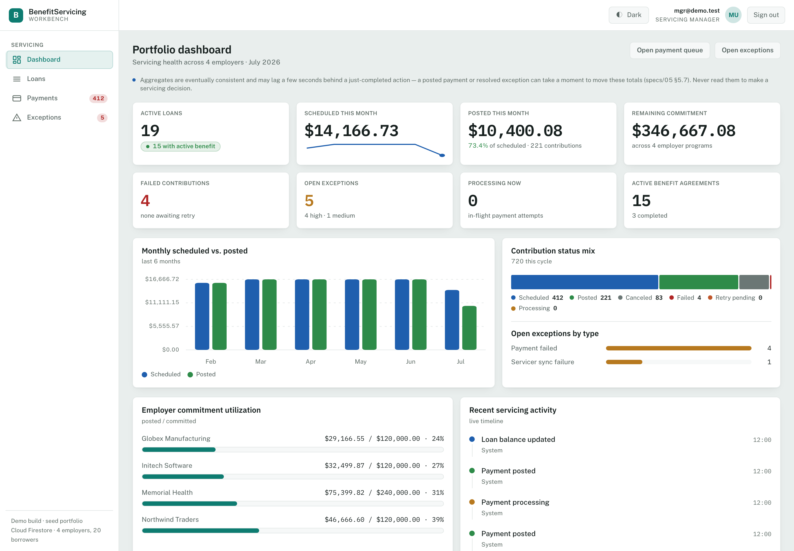
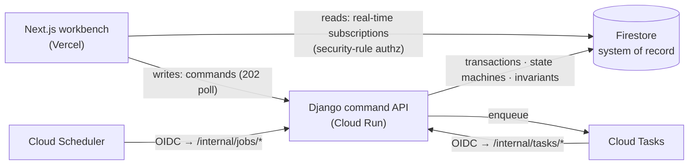

# BenefitServicing Workbench

An operations console for servicing **employer-sponsored student-loan repayment benefits** — the back office where a servicing team activates benefits, runs employer-funded contribution schedules, processes payments, works exceptions, and reads an immutable audit trail. Firestore is the system of record; a Django command backend owns every write; a Next.js workbench reads it live.

> **The point of the build:** use Firestore *responsibly* for a financial workflow — without pretending a document database removes the need for explicit transactions, idempotency, crash-recovery, and audit controls. Everything here follows from that one question.



**Status:** Phases 1–6 complete and **deployed live** — a password-gated demo on Cloud Run + Vercel + real Firestore/Auth (project `bsw-demo`). The per-phase, per-PR history is in [Build history](#build-history) at the bottom.

## Start here (for reviewers)

Short on time? In order of signal:

1. **The thesis** — [specs/01 §1.6](specs/01-product-overview.md) + [specs/02](specs/02-architecture.md). The read/write split, and why Firestore doesn't excuse you from the hard parts.
2. **The load-bearing correctness** — idempotency-in-transaction, the crash-safe two-phase payment, and the reconciliation re-drive. Read [specs/08](specs/08-idempotency-and-consistency.md) → [09](specs/09-payment-processing.md), then the code: [`backend/common/`](backend/common) (the framework-free money + state-machine core, 60 unit tests), [`backend/payments/`](backend/payments), [`backend/idempotency/`](backend/idempotency).
3. **How it was built** — the [engineering reports](specs/engineering-reports/) record each phase's *adversarial* QA, two independent security reviews, and the live-deploy record — including real bugs the process caught that compiled clean (a payment-cancellation race, a double-charge fencing gap, a post-commit crash-recovery gap).
4. **Try it live** — a password-gated demo (link + password shared with reviewers). Land on the dashboard; on **Loans**, pick an employer to populate the portfolio (it's filter-first by design, not empty).

**Reference:** the [22-doc spec set](specs/README.md) · the [OpenAPI contract](specs/openapi.yaml) (authoritative) · the [Firestore rules & indexes](firebase/) (deployable + tested) · the [interactive wireframes](specs/wireframes.html).

## Architecture

A CQRS-style split. The frontend **reads** Firestore directly — real-time subscriptions, authorized by security rules on the role claim. **Every write** goes through a Django command: transactions, state-machine validation, invariants, idempotency. Async work runs on Cloud Tasks + Scheduler behind an OIDC-gated `/internal` surface. The consequence that drives the whole design: **reads are authorized by security rules, writes by Django** — both from the same Firebase custom-claim role. See [specs/02](specs/02-architecture.md).



## Run it locally

```bash
make demo    # emulator + seeded data + Django (inline) + Next.js — one command; Ctrl-C to stop
```

Open **http://localhost:3000**, sign in as `mgr@demo.test` / `DemoPass!234`, and follow [`docs/demo-script.md`](docs/demo-script.md) — a ~2-minute walk through the money path, the idempotency + `If-Match` guards, exception recovery, and server-side authorization. Zero cloud cost; the deterministic seed is 20 borrowers across four employers, each a distinct scenario.

<sub>Prereqs: Python 3.12 + backend deps, Node 20 + `frontend/` deps, Java 21 + firebase-tools.</sub>

## What CI verifies

The safety-critical core runs fully offline; everything else is verified on CI (which has the emulator + network):

```bash
cd backend && python -m unittest discover -s common/tests -p 'test_*.py' -t .   # 60 core tests, no deps
cd firebase && npm install && npm run test:rules:ci                            # Firestore security rules
npx @stoplight/spectral-cli lint specs/openapi.yaml --fail-severity=error       # the API contract
cd frontend && npm install && npm run lint && npm run test && npm run build     # the workbench
```

On CI: the Django command + async layer (the two-phase payment, concurrency + fencing gates, the reconciliation sweeper + lease reaper, the projection flows) under the Firestore emulator, plus the Playwright critical-path **e2e** (seed → Django → Next → Playwright). `.github/workflows/ci.yml` gates each job on file presence — backend, frontend, and e2e are all active.

## Deploy

Topology is pinned in [specs/21](specs/21-deployment-and-operations.md) (Cloud Run + Firestore + Cloud Tasks/Scheduler; frontend on Vercel). The [`infrastructure/`](infrastructure/) scripts realize the runbook as idempotent, parameterized `bash`+`gcloud`:

```bash
cp infrastructure/config.env.example infrastructure/config.env   # set PROJECT_ID, etc.
bash infrastructure/scripts/provision-all.sh                     # IAM → API → queues → scheduler → Firestore
bash infrastructure/scripts/teardown.sh                          # delete the billable resources
```

Cost-sensitive by default: Cloud Run scales to zero and `teardown.sh` stops the meter. CI shellchecks these scripts and builds `backend/Dockerfile` for real. The full live-deploy record — and the script gaps the real deploy exposed — is in the [devops deployment report](specs/engineering-reports/deployment-devops.md).

## Demo security posture

This is a **public demo**, built to be one safely:

- **Synthetic data, simulated payments.** Invented borrowers; the payment adapter is a simulator — no real PII, no real money, no real processor.
- **Open by design.** The sign-in screen publishes the three demo credentials so anyone can try every role — intentional, and bounded.
- **Bounded blast radius.** Reads are deny-by-default (a no-role account sees nothing); every write is authorized server-side by Django (the UI role gate is affordance only); `/internal` is OIDC-gated; the command endpoints are rate-throttled; Cloud Run is capped. Set a budget/quota alert before exposing it publicly.
- **Self-healing.** A daily `reset-demo` job re-seeds the dataset, so demo-data churn does not persist.
- **No pivot.** An app user — even "admin" — can only touch the app's own Firestore model; they cannot assume the service account, run code, or reach the GCP project.

## Build history

Phases 1–6 are complete and merged to `main` — each CI-green + CodeRabbit-reviewed — and the system is **deployed live**. Per-phase [engineering reports](specs/engineering-reports/) track each build + QA pass.

<details>
<summary>The per-phase, per-PR breakdown</summary>

- **Phase 1 — the framework-free core** (PRs #1, #4). `backend/common/`: the money/residual solver, explicit state machines, invariants, deterministic IDs (**60 stdlib unit tests**) + the project scaffold; plus a read-only security review and its hardening.
- **Phase 2 — the command layer** (PRs #2, #3, #5). Every write as a transactional Django command: activation, the two-phase payment, suspend/resume/terminate, the employment cascade, exceptions, notes, admin.
- **Phase 3 — the async layer** (PR #5). OIDC-gated Cloud Tasks/Scheduler handlers behind a 202-cloud/200-inline completion protocol, a reconciliation sweeper + lease reaper, and recompute-from-source read-model projections.
- **Phase 4 — the workbench UI** (PRs #6, #7). The *ledger + control room* design system + dashboard + loan portfolio (part 1); the loan/benefit detail + payment/exception worklists + auth surface + Playwright e2e (part 2).
- **Phase 5 — adversarial security review** (PR #8). Attacked the async + UI layers (no CRITICAL/HIGH/MEDIUM), then hardened.
- **Phase 6 — deployment** (PR #11). The `infrastructure/` IaC (Cloud Run, queues, scheduler, teardown), `make demo`, and the demo script — since **run for real** against project `bsw-demo` (Cloud Run + Vercel + Firestore/Auth, seeded, password-gated).
- **Follow-ups:** an integrity pass (#10), a docs/UX pass (#12), and the live-deploy hardening (#13).

**Not yet built:** only the `propagate-denormalized` fan-out (`U13`) — deferred, awaiting its producer command. Everything else is built, merged, and deployed live.

</details>
